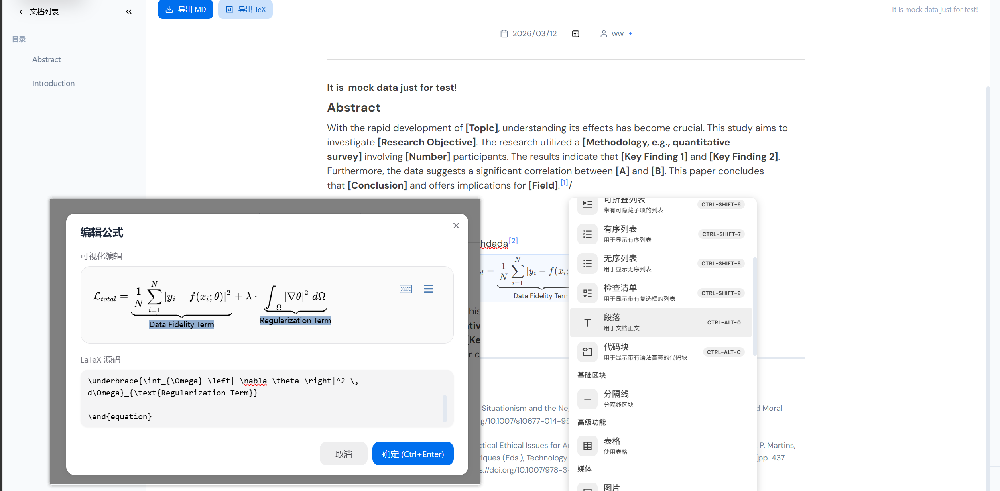
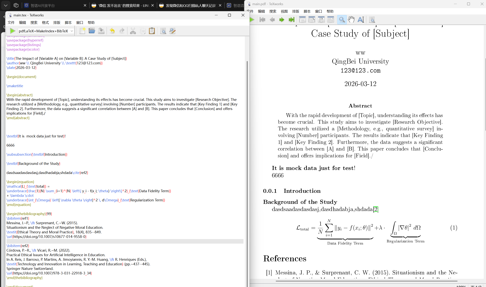
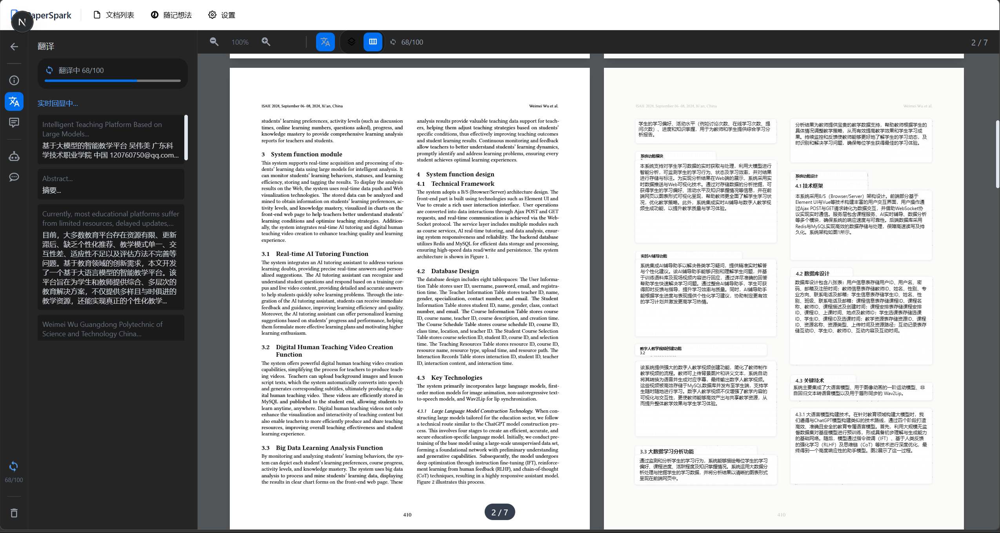
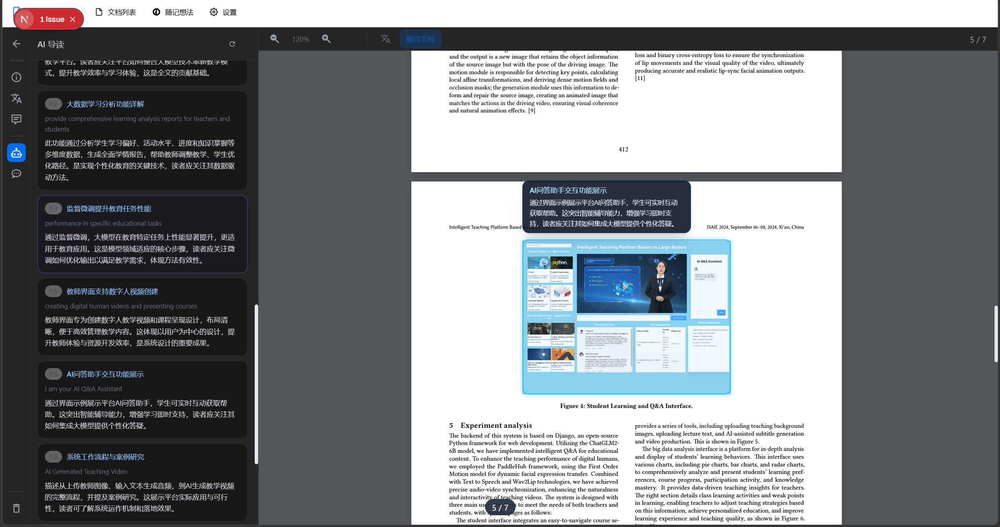
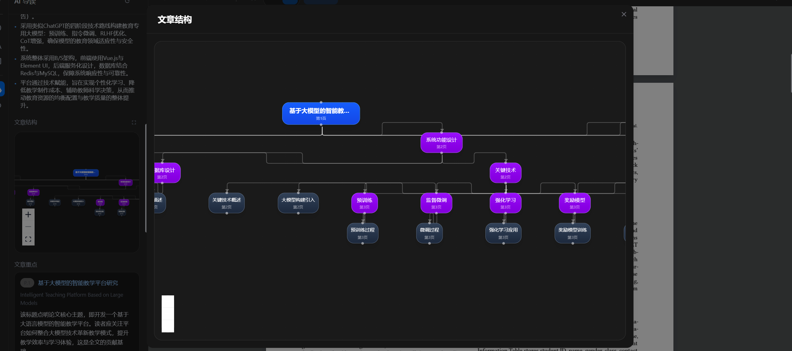
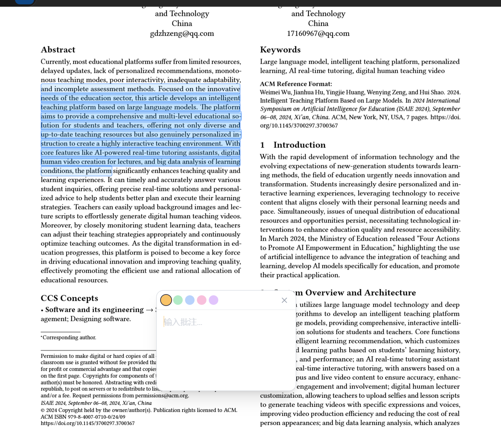
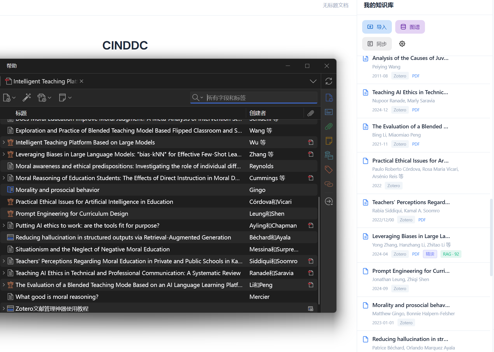
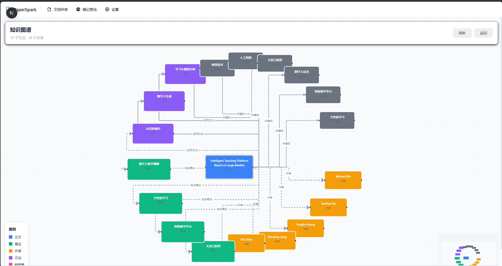
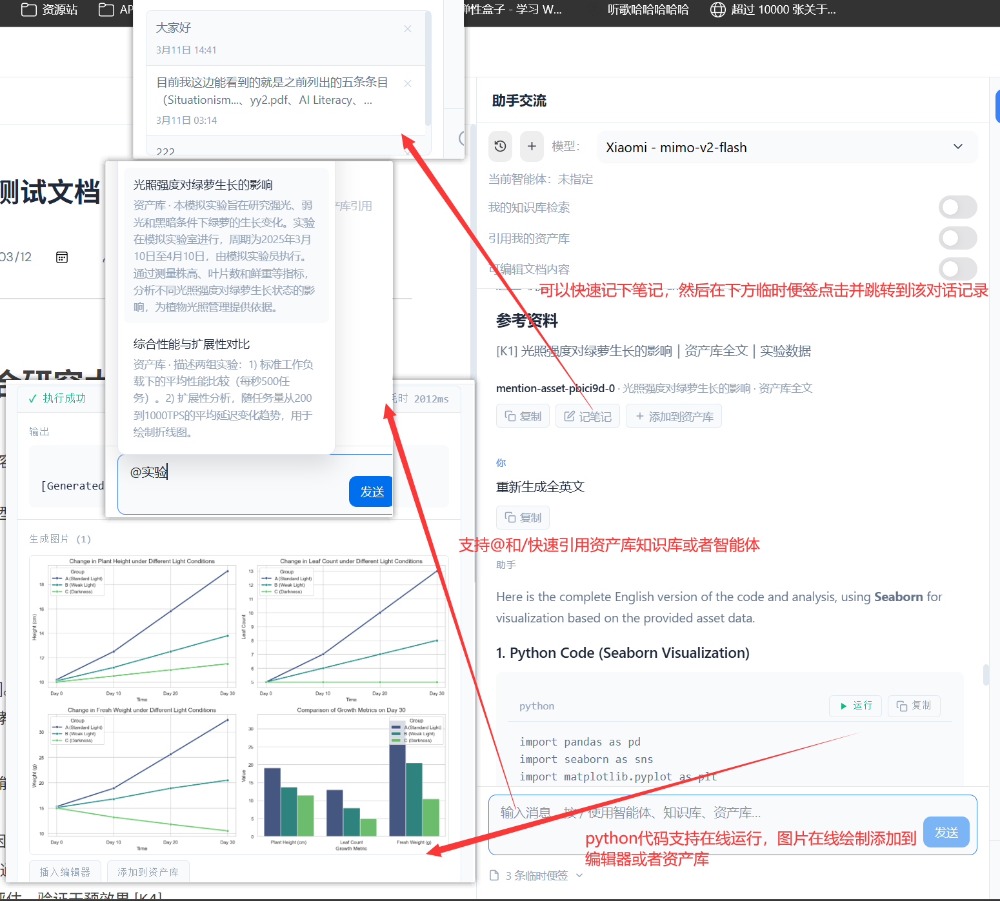
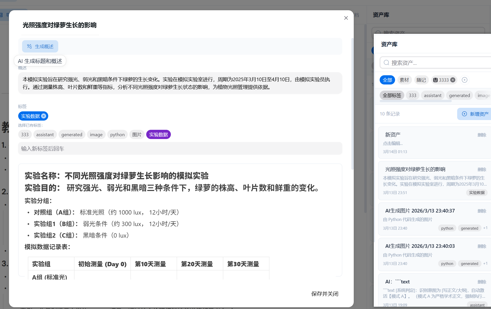

<div align="center">


# PaperSpark

AI 驱动的论文阅读、知识沉淀与学术写作工作台

[](https://nextjs.org/)
[](https://react.dev/)
[](https://www.typescriptlang.org/)
[](LICENSE)

</div>

## 项目概览

PaperSpark 面向科研与高阶学习场景，提供从文献导入、沉浸式阅读、知识图谱构建到论文编辑导出的完整闭环。

| 能力模块 | 说明 |
| --- | --- |
| 文献与知识库 | 本地文献管理、Zotero 同步、资产库归档、引用追踪 |
| AI 学术助手 | 多智能体协作、内容检索、段落改写、文段纠错、翻译与摘要 |
| 沉浸式阅读 | 双栏对照阅读、重点提取、章节导图、批注与跳转 |
| 写作编辑器 | 富文本 + 可视化公式 + 引用系统 + 结构化写作辅助 |
| 结构化理解 | 自动知识图谱生成、跨文献概念关系可视化 |
| 导出交付 | 支持 Markdown、TeX 以及最终 LaTeX Zip 交付 |

## 快速开始

### 环境要求

- Node.js 18+
- pnpm 8+
- Python 3.10+（用于微服务）

### 安装与运行

```bash
pnpm install
pnpm dev
```

默认访问地址为 http://localhost:3000。

### 微服务依赖安装

```bash
cd services/surya_ocr_service
pip install -r requirements.txt
```

### 微服务启动路径

```powershell
.\scripts\start-surya-service.ps1
```

默认服务地址为 http://127.0.0.1:8765。若需在 Next.js 侧代理，请设置环境变量：

```env
SURYA_OCR_SERVICE_URL=http://127.0.0.1:8765
```

### GPU 加速建议

- 推荐在支持 CUDA 的环境中运行微服务，以获得更快的文档解析与推理速度。
- 建议先安装与你本机 CUDA 版本匹配的 PyTorch（GPU 版），再安装其余依赖。
- 若无 GPU，会自动以 CPU 方式运行，但大文件处理耗时会明显增加。

## 功能详解

### 1) 文献接入与知识库管理

- 支持本地上传、URL 导入、Zotero 同步，统一进入知识库。
- 条目支持摘要翻译、引用信息保留、标签管理与删除联动清理。
- 知识项可与后续助手检索、导读、编辑器引用形成闭环。

### 2) 沉浸式阅读与导读系统

- 提供文档信息、翻译、笔记、导读、问答等多侧栏协同模式。
- 支持重点提取与跳转，降低长文定位成本。
- 支持章节结构导图、段落关联视角与阅读进度式浏览。
- 支持文献阅读中的 paper ref 链接定位与上下文回看。

### 3) AI 助手协同工作流

- 支持多智能体切换，适配不同任务（检索、改写、纠错、结构化输出等）。
- 支持引用知识库、引用资产库、快速笔记与会话历史回溯。
- 支持代码块运行反馈与结果回填，便于实验性分析任务。

### 4) 写作编辑与公式能力

- 富文本编辑器支持结构化写作、引用插入、目录导航。
- 内置可视化公式编辑与 LaTeX 输入，兼容常见数学表达场景。
- 支持文段纠错与改写辅助，减少学术英文表达阻力。

### 5) 知识图谱自动构建

- 面向论文、作者、概念、方法、关键词构建多类型节点关系。
- 在阅读流程中可触发自动分析与图谱增量构建。
- 提供图谱可视化浏览，支持节点关系理解与论文间关联探索。

### 6) 导出与交付

- 支持 Markdown、TeX、LaTeX Zip 等导出形态。
- 覆盖作者信息、摘要、关键词、引用与图片资源路径。
- 适配学术写作后续排版与投稿流程。

## 界面与能力实录

以下展示按任务流重新编排，便于读者从「阅读 -> 理解 -> 写作 -> 交付」连续浏览。

### 1) 核心工作区与编辑体验

<table>
    <tr>
        <td width="62%" valign="top">
            
            <p align="center">主编辑区与可视化公式编辑</p>
        </td>
        <td width="38%" valign="top">
            
            <p align="center">智能体配置面板</p>
        </td>
    </tr>
    <tr>
        <td width="62%" valign="top">
            
            <p align="center">TeX 导出与数学环境兼容</p>
        </td>
        <td width="38%" valign="top">
            
            <p align="center">文献阅读中的链接定位</p>
        </td>
    </tr>
</table>

### 2) 文献阅读与知识提取

<table>
    <tr>
        <td width="50%" valign="top">
            
            <p align="center">双栏翻译与阅读联动</p>
        </td>
        <td width="50%" valign="top">
            
            <p align="center">重点提取并跳转原文位置</p>
        </td>
    </tr>
    <tr>
        <td width="50%" valign="top">
            
            <p align="center">章节结构导图</p>
        </td>
        <td width="50%" valign="top">
            
            <p align="center">高亮与批注工作流</p>
        </td>
    </tr>
</table>

### 3) 知识库与知识图谱

<table>
    <tr>
        <td width="50%" valign="top">
            
            <p align="center">Zotero 批量同步入库</p>
        </td>
        <td width="50%" valign="top">
            
            <p align="center">多论文知识图谱构建</p>
        </td>
    </tr>
</table>

### 4) 助手协同与资产管理

<table>
    <tr>
        <td width="45%" valign="top">
            
            <p align="center">引用知识库、快速笔记、代码执行与绘图</p>
        </td>
        <td width="55%" valign="top">
            
            <p align="center">资产标签体系与富文本内容归档</p>
        </td>
    </tr>
</table>

### 5) 视频演示


<table>
    <tr>
        <td width="50%" valign="top">
            <video src="https://github.com/user-attachments/assets/47746635-5b73-4d3d-874e-19b77aba413b" controls width="100%"></video>
            <p align="center">AI 交互协同操作文档</p>
        </td>
        <td width="50%" valign="top">
            <video src="https://github.com/user-attachments/assets/7797a2b6-c451-48a2-ae8b-ef05b2b17601" controls width="100%"></video>
            <p align="center">文献多智能体全方位检索</p>
        </td>
    </tr>
    <tr>
        <td width="50%" valign="top">
            <video src="https://github.com/user-attachments/assets/9c508a2f-2c20-4a15-b2a4-716514b9f8a4" controls width="100%"></video>
            <p align="center">文献智能引用</p>
        </td>
        <td width="50%" valign="top">
            <video src="https://github.com/user-attachments/assets/3df403de-4c62-44ae-a2f1-70220e7cff97" controls width="100%"></video>
            <p align="center">智能文段纠错</p>
        </td>
    </tr>
</table>

## 架构与代码组织

```text
paper_reader/
├─ app/
│  ├─ api/
│  │  ├─ ai/                    # 助手、纠错、翻译、检索等 AI 接口
│  │  ├─ knowledge/             # 知识摘要、上传与处理
│  │  ├─ knowledge-graph/       # 图谱分析与构建
│  │  ├─ pdf/                   # PDF 与 OCR 处理链路
│  │  └─ zotero/                # Zotero 同步
│  ├─ documents/                # 文档列表
│  ├─ editor/[id]/              # 编辑器主页面
│  ├─ immersive/[id]/           # 沉浸式阅读
│  └─ knowledge-graph/          # 图谱可视化页面
├─ components/                  # 业务组件
│  ├─ Assistant/                # 助手与工具调用面板
│  ├─ Editor/                   # 编辑器、公式、引用等核心组件
│  ├─ Knowledge/                # 知识库面板
│  ├─ Search/                   # 文献检索模块
│  └─ Thought/                  # 随记与思维辅助
├─ lib/                         # 核心能力封装（RAG、导出、图谱、存储等）
├─ services/surya_ocr_service/  # Python OCR 服务
└─ md_assets/                   # README 演示素材
```

## 技术栈

| 类别 | 技术 |
| --- | --- |
| 应用框架 | Next.js 15, React 19, TypeScript |
| 编辑与交互 | BlockNote, HeroUI, Framer Motion |
| AI 与推理 | Vercel AI SDK, OpenAI 兼容接口, ChromaDB |
| 文档处理 | pdfjs-dist, mathlive, JSZip |
| 图谱可视化 | @xyflow/react |
| 样式系统 | Tailwind CSS v4 |

## Roadmap

- [ ] 基于精读文章列表的 RAG 图谱增强
- [ ] 助手端生成图片与 Mermaid，并一键入资产库
- [ ] 助手大纲生成与过程可视化
- [ ] 选中文本后按意图执行定向 AI 操作
- [ ] 资产库引用体系进一步完善
- [ ] 文档工具调用门槛与准确率持续优化
- [ ] Python 代码执行环境体验增强

## 致谢

- [Next.js](https://nextjs.org/)
- [React](https://react.dev/)
- [BlockNote](https://www.blocknotejs.org/)
- [Vercel AI SDK](https://sdk.vercel.ai/)
- [HeroUI](https://www.heroui.com/)
- [Tailwind CSS](https://tailwindcss.com/)
- [Zotero](https://www.zotero.org/)
- [surya-ocr](https://github.com/surya-ocr/surya)

## License

本项目基于 CC BY-NC 4.0 协议开源。

- 允许：学习、研究、个人使用、署名转载
- 禁止：商业化使用、付费分发、集成至商业产品

详见 [LICENSE](LICENSE)。

## LaTeX 导出

PaperSpark 已提供基本 LaTeX 导出能力，步骤如下

1. 在编辑器中点击导出按钮，选择导出语言（中文或英文）。
2. 系统会生成一个 LaTeX Zip 包，内含 main.tex、图片资源、参考文献和编译说明。
3. 解压后可直接使用 xelatex 或 pdflatex 编译。
4. 含公式、图片、引用的论文草稿可保持较高一致性，后续可进一步使用模板调整格式。